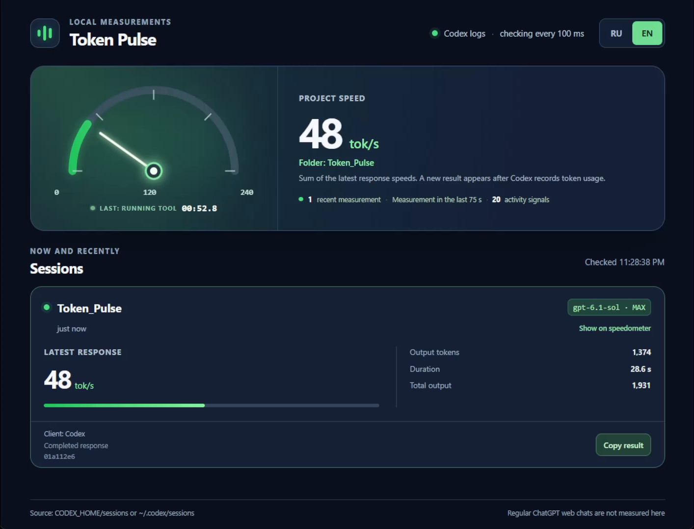

<p align="center">
  
</p>

<p align="center">
  <a href="README.md"><strong>English</strong></a> · <a href="README.ru.md">Русский</a>
</p>

<p align="center">
  <a href="https://github.com/d-ridelman/token-pulse/releases/latest"></a>
  <a href="LICENSE"></a>
  
  
</p>

<p align="center">
  <strong>See the pace of a Codex run without sending your session logs anywhere.</strong><br>
  Completed-response token speed, a speedometer, model details, and live turn activity.
</p>

<p align="center">
  <a href="https://github.com/d-ridelman/token-pulse/releases/latest"><strong>Download the Windows app</strong></a>
  &nbsp;·&nbsp;
  <a href="#demo">Watch the 30-second demo</a>
  &nbsp;·&nbsp;
  <a href="#quick-start">Run from source</a>
</p>

## Demo

<p align="center">
  <a href="https://github.com/d-ridelman/token-pulse/releases/download/v1.0.0/Token-Pulse-demo-30fps.mp4">
    
  </a>
</p>

<p align="center">
  <a href="https://github.com/d-ridelman/token-pulse/releases/download/v1.0.0/Token-Pulse-demo-30fps.mp4"><strong>▶ Watch the real-time demo — 30 seconds, 30 FPS (MP4)</strong></a>
</p>

The video shows one TypeScript task on **GPT-6.1 Sol MAX**; its ten tests passed. The displayed rate is one completed-response measurement, not a model-wide benchmark or a tokenizer-normalized comparison. The capture contains only the Token Pulse window and no audio.

## What you see

| | |
|---|---|
| **Measured speed** | Output tokens per second for the latest completed model response. The numeric value changes only after a usage record arrives. |
| **Live activity** | A running turn timer, the latest observed Codex event, and an activity-signal count between speed measurements. These do not invent unreported tokens. |
| **Speedometer** | A smooth needle for the measured value. Select one session or show the sum of recent sessions. Needle motion is visual animation. |
| **Project scope** | Show only sessions started in one folder and its child folders. |
| **Sharing** | Copy model, output tokens, duration, speed, and method without prompts, paths, or session IDs. |

## Quick start

**Windows x64:** download the [portable EXE](https://github.com/d-ridelman/token-pulse/releases/latest). Run it directly; no installer or Node.js is needed. The binary is currently unsigned.

**From source (Windows, macOS, Linux):** install Node.js and npm, then:

```sh
npm ci
npm start
```

On Windows, `start.cmd` launches a locally installed Electron binary. Use `npm test` to run the monitor tests or `npm run build:portable` on Windows to build an EXE in `release/`.

### Show just one project

Token Pulse reads `CODEX_HOME/sessions`, or `~/.codex/sessions` when `CODEX_HOME` is unset. Set `TOKEN_PULSE_PROJECT_DIR` to filter by the working directory recorded in each session:

```powershell
$env:TOKEN_PULSE_PROJECT_DIR = 'C:\work\my-project'
$env:TOKEN_PULSE_LANG = 'en'
npm start
```

The UI supports **RU / EN**, with Russian as the default. `TOKEN_PULSE_LANG` sets the startup language; it can also be changed in the app.

## Reading the number

Token Pulse primarily reads Codex `token_usage_record` events. It divides a completed response's reported output tokens by the time from the nearest available pre-request event (turn start or last tool output) to its usage record. Older logs use the difference between cumulative `token_count` events; the method appears on each card.

Output tokens can include reasoning and other non-visible output. The timing can include request latency. The local log does not expose the exact first-token time or a token-by-token stream, so this is **effective completed-response throughput**, not instantaneous decoding speed. [OpenAI's token counting guide](https://developers.openai.com/api/docs/guides/token-counting) explains what reported output includes.

Active files are checked every 100 ms, with filesystem notifications when available. A measurement remains “recent” for 75 seconds; a card remains visible for 20 minutes. The turn timer and activity signals continue to move between usage records. The model badge uses the latest `turn_context.model` and `effort`; backend rerouting is not independently verified.

## Local by design

The app reads local Codex logs and makes no account connection or telemetry request. Regular ChatGPT web chats are outside this source. To share a result, use **Copy result** or a screenshot. Keep raw session logs private.

MIT licensed. See [LICENSE](LICENSE).
