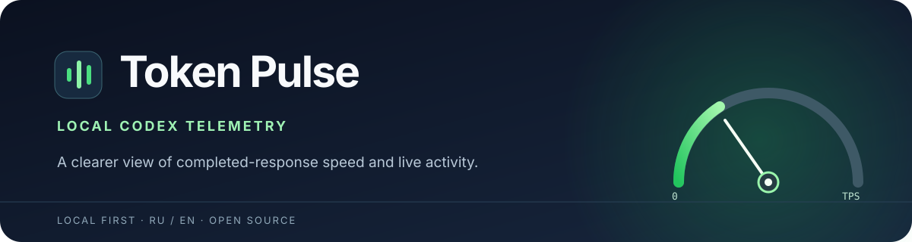

<p align="center">
  
</p>

<p align="center">
  <a href="README.md">English</a> · <a href="README.ru.md"><strong>Русский</strong></a>
</p>

<p align="center">
  <a href="https://github.com/d-ridelman/token-pulse/releases/latest"></a>
  <a href="LICENSE"></a>
  
  
</p>

<p align="center">
  <strong>Наблюдай за работой Codex, не передавая журналы сессий наружу.</strong><br>
  Скорость завершённых ответов, спидометр, модель и активность текущего хода.
</p>

<p align="center">
  <a href="https://github.com/d-ridelman/token-pulse/releases/latest"><strong>Скачать для Windows</strong></a>
  &nbsp;·&nbsp;
  <a href="#демо">Посмотреть демо на 30 секунд</a>
  &nbsp;·&nbsp;
  <a href="#быстрый-старт">Запустить из исходников</a>
</p>

## Демо

https://github.com/user-attachments/assets/8a51b5d2-c77f-42e7-b4c7-74762be95c4c

На видео — одна TypeScript-задача на **GPT-6.1 Sol MAX**; все десять проверок прошли. Показанная скорость относится к одному завершённому ответу, а не к модели вообще и не к сравнению токенизаторов. Записано только окно Token Pulse, без звука.

## Что видно в приложении

| Возможность | Что показывает |
|---|---|
| **Измеренная скорость** | Выходные токены в секунду для последнего завершённого ответа. Число меняется только после записи о расходе. |
| **Активность хода** | Тикающий таймер, последнее наблюдаемое событие Codex и счётчик сигналов активности между замерами. Неизвестные токены не оцениваются. |
| **Спидометр** | Плавная стрелка для измеренного числа. Можно выбрать одну сессию или сумму свежих замеров. Движение стрелки — анимация. |
| **Один проект** | Отображение только сессий, начатых в выбранной папке и её подкаталогах. |
| **Публикация результата** | Копирование модели, токенов, длительности, скорости и метода без переписки, путей и ID сессии. |

## Быстрый старт

**Windows x64:** скачайте [переносимый EXE](https://github.com/d-ridelman/token-pulse/releases/latest) и запустите без установщика и Node.js. Сейчас бинарник не подписан цифровой подписью.

**Из исходников (Windows, macOS, Linux):** установите Node.js и npm, затем:

```sh
npm ci
npm start
```

В Windows `start.cmd` запускает локально установленный Electron. `npm test` проверяет модуль чтения журналов; `npm run build:portable` на Windows собирает EXE в `release/`.

### Только выбранная папка

Token Pulse читает `CODEX_HOME/sessions`, а если `CODEX_HOME` не задана — `~/.codex/sessions`. Переменная `TOKEN_PULSE_PROJECT_DIR` ограничивает выдачу рабочей папкой из метаданных сессии:

```powershell
$env:TOKEN_PULSE_PROJECT_DIR = 'C:\work\my-project'
$env:TOKEN_PULSE_LANG = 'ru'
npm start
```

Интерфейс поддерживает **RU / EN**, по умолчанию выбран русский. `TOKEN_PULSE_LANG` задаёт язык при запуске; переключить его можно и в окне.

## Как понимать скорость

Основной источник — события Codex `token_usage_record`. Выходные токены завершённого ответа делятся на время от ближайшего доступного события перед запросом (начала хода или завершения последнего инструмента) до записи о расходе. Для старых журналов берётся разница накопленных счётчиков `token_count`; метод указан в карточке.

Выходные токены могут включать рассуждение и другой невидимый вывод. Время может включать задержку запроса. Локальный журнал не сообщает точное время первого токена и не содержит потока отдельных токенов. Поэтому это **эффективная скорость завершённого ответа**, а не мгновенная скорость генерации. Состав выходного счётчика объясняет [документация OpenAI](https://developers.openai.com/api/docs/guides/token-counting).

Активные файлы проверяются каждые 100 мс; когда возможно, используются уведомления файловой системы. Замер считается свежим 75 секунд, карточка видна 20 минут. Между записями о расходе движется таймер и обновляются сигналы активности. Метка модели берётся из последних `turn_context.model` и `effort`; возможная переадресация запроса сервером отдельно не проверяется.

## Данные остаются у вас

Приложение читает локальные журналы Codex и не подключается к аккаунту или телеметрии. Обычные веб-чаты ChatGPT в этот источник не входят. Для публикации используйте кнопку **«Скопировать результат»** или скриншот. Сырые журналы сессий не загружайте.

Лицензия — [MIT](LICENSE).
